# Luna Workflow Architecture

## Complete Pipeline: Top-Down Context-Aware Generation

This workflow inverts the traditional upscaling paradigm. Instead of generating small and hoping details emerge when upscaled, we **plan at target resolution** and **execute at model-native resolution**.

```mermaid
flowchart TD
    %% Config Gateway - Master Blueprint
    CG["Config Gateway\\n-----------\\n- Model/CLIP/VAE\\n- Prompts + LoRAs\\n- Target: 4096x4096"]
    
    CG -->|positive_4k\nArea coords at 4K| POS4K["4K Conditioning\\n---------\\n512x512 latent space"]
    CG -->|negative_4k\nArea coords at 4K| NEG4K["4K Conditioning\\n---------\\n512x512 latent space"]
    CG -->|latent_4k| LAT4K["4K Empty Latent\\n---------\\n4096x4096 px\\n512x512 latent\\nPure noise scaffold"]
    
    %% Native Canvas Downscale
    LAT4K --> NCD["Luna Native Canvas Downscale\\n--------------------\\nscale_factor = 4.0"]
    POS4K --> NCD
    NEG4K --> NCD
    
    NCD -->|latent_1k\nVariance corrected| LAT1K["1K Latent\\n-----\\n1024x1024 px\\n128x128 latent\\nDownscaled noise"]
    NCD -->|positive_1k\nArea coords / 4| POS1K["1K Conditioning\n-----\n128x128 latent space"]
    NCD -->|negative_1k\nArea coords / 4| NEG1K["1K Conditioning\n-----\n128x128 latent space"]
    
    %% Initial Generation at Model Native
    LAT1K --> KS["KSampler\\n-----\\nModel Native Resolution\\n1024x1024 px\\nSteps: 20-30\\nDenoise: 1.0"]
    POS1K --> KS
    NEG1K --> KS
    
    KS -->|Generated latent| GEN1K["1K Generated Latent\\n-----\\n128x128 latent\nInitial composition"]
    
    %% Decode to Pixels
    GEN1K --> DEC["VAE Decode\\n----\\nLatent -> Pixels"]
    DEC -->|1K pixels| PIX1K["1K Image\\n-----\\n1024x1024 px\\nBlocky but coherent"]
    
    %% SAM3 Detection (on 1K for efficiency)
    PIX1K --> SAM["SAM3 Detector\\n----\\nSemantic segmentation\\n1024x1024 px\\n(Normalized output)"]
    SAM -->|detection_pipe| PIPE["Detection Pipe\\n----\\n* Bboxes (normalized 0-1)\\n* Masks\\n* Concept conditionings\\n* Layer assignments"]
    
    %% Upscale with Model
    PIX1K --> UPS["Upscale Model\\n----\\n4x ESRGAN/RealESRGAN\\nLearned hallucination\\nBreaks up blocks"]
    UPS -->|4K pixels| PIX4K["4K Upscaled Image\\n----\\n4096x4096 px\\nNatural detail structure"]
    
    %% Encode Back to Latent
    PIX4K --> ENC["VAE Encode\\n----\\nPixels -> Latent"]
    ENC -->|Smooth 4K latent| SMOOTH4K["4K Encoded Latent\\n----\\n512x512 latent\\nNo blocks!\\nNatural distribution"]
    
    %% Semantic Detailer - Per-Object Refinement
    SMOOTH4K --> SD["Semantic Detailer\\n-----\\nPer-detection refinement\\nVariable crop sizes\\nResized to 1024x1024"]
    PIPE --> SD
    POS4K -->|Cropped to bbox| SD
    NEG4K -->|Cropped to bbox| SD
    LAT4K -->|Noise crops| SD
    
    SD -->|Per detection| CROPS["Detection Crops\\n----\\nExample: 5 faces\\nEach: 1024x1024\\nBatched sampling\\n----\\nConditioning:\\n- Cropped global 4K\\n- + Concept override\\n----\\nScaffold: 4K noise\\ncropped to bbox"]
    
    CROPS --> COMP1["Composite Back\\n----\\nPaste to 4K canvas\\nMask blending"]
    COMP1 -->|Refined detections| REF4K["4K Semantically Refined\\n----\\n4096x4096 px\\n+ refinement_mask"]
    
    %% Chess Refiner - Global Tiled Refinement
    REF4K --> CR["Chess Refiner\\n----\\nGlobal tiled refinement\\n----\\nTile size: 1024x1024\\nGrid: 5x5 = 25 tiles\\nOverlap: ~256px\\n----\\nEven pass: 13 tiles\\nOdd pass: 12 tiles"]
    POS4K -->|Cropped per tile| CR
    NEG4K -->|Cropped per tile| CR
    LAT4K -->|Sliced per tile| CR
    
    CR --> EVEN["Even Pass Chess Pattern\\n----\\nTiles: (0,0), (0,2), (0,4)\\n       (1,1), (1,3)\\n       (2,0), (2,2), (2,4)\\n       etc...\\n----\\nBatched: 4-8 tiles/batch\\nPaste: NO feathering"]
    
    EVEN --> ODD["Odd Pass Chess Pattern\\n----\\nTiles: (0,1), (0,3)\\n       (1,0), (1,2), (1,4)\\n       (2,1), (2,3)\\n       etc...\\n----\\nBatched: 4-8 tiles/batch\\nPaste: Edge-aware feathering"]
    
    ODD --> FINAL["Final 4K Image\\n----\\n4096x4096 px\\nGlobally coherent\\nSemantically refined\\nDetail-rich"]
    
    %% Annotations
    classDef master fill:#4ade80,stroke:#22c55e,color:#000
    classDef downscale fill:#fbbf24,stroke:#f59e0b,color:#000
    classDef native fill:#60a5fa,stroke:#3b82f6,color:#000
    classDef upscale fill:#a78bfa,stroke:#8b5cf6,color:#000
    classDef detect fill:#f472b6,stroke:#ec4899,color:#000
    classDef refine fill:#fb923c,stroke:#f97316,color:#000
    
    class CG,POS4K,NEG4K,LAT4K master
    class NCD,POS1K,NEG1K,LAT1K downscale
    class KS,GEN1K native
    class UPS,PIX4K,ENC,SMOOTH4K upscale
    class SAM,PIPE detect
    class SD,CROPS,COMP1,REF4K,CR,EVEN,ODD,FINAL refine
```



## Key Architectural Principles

### 1. **Top-Down Context Planning**
- **All conditioning generated at 4K** (target resolution)
- Area coordinates in latent space: 512×512 for 4K
- Text embeddings are resolution-agnostic
- 4K noise scaffold provides spatial coherence blueprint

### 2. **Model-Native Execution**
- **Never sample beyond model's native resolution**
- Initial generation: 1K (model comfortable zone)
- Refinement: 1K crops/tiles (model comfortable zone)
- Only pixels go to 4K, latents stay at native scale

### 3. **Variance-Preserving Downscaling**
```
4K Noise (512×512 latent) → Downscale with area mode
                          → Variance correction: × sqrt(4) = × 2
                          → 1K Noise (128×128 latent)
```

### 4. **Conditioning Strategy**

**Current Implementation (v1):**
- Uses global conditioning for all tiles (like Ultimate SD Upscale)
- No per-tile cropping or masking
- Works well at low denoise (0.3-0.5)
- Latent structure provides spatial context

**Planned Enhancement (v2) - Mask Conditioning:**
- Add mask per tile to constrain refinement region
- Prevents hallucination at higher denoise (0.6+)
- Matches Ultimate SD Upscale's approach
- Mask tells model: "Only modify pixels HERE, respect surroundings"

**Optional Enhancement (v3) - Area Conditioning:**
- Add area conditioning for compositional control during initial 1K generation
- "4K Compositional Density" - plan at 4K, execute at 1K
- Downscaled 4K area coords provide richer spatial hints than native 1K planning
- Theoretical improvement in initial composition quality

**Key Insight:**
- **Area Conditioning** = Generative planning (T2I: "put object HERE")
- **Mask Conditioning** = Refinement constraint (I2I: "only change HERE")
- Chess Refiner needs masks, not area coords (working on existing latent)

### 5. **Scaffold Coherence**
- Same 4K noise field used throughout
- Semantic Detailer: crops noise to bbox
- Chess Refiner: slices noise to tiles
- **No regeneration** - always the same spatial structure

### 6. **Batched Sampling**
- **Semantic Detailer**: Batch all detections (e.g., 5 faces → 1 batch)
- **Chess Refiner**: Batch chess pattern (e.g., 13 even tiles → 2-3 batches)
- Massive VRAM/time savings vs sequential

### 7. **Progressive Refinement**
```
1K Generation (rough composition)
    ↓
Upscale (add learned detail)
    ↓
Semantic Refinement (perfect faces/objects)
    ↓
Global Refinement (coherent details everywhere)
```

## Resolution Tracking

| Stage | Canvas Size | Latent Size | Conditioning | Noise |
|-------|------------|-------------|--------------|-------|
| Config Gateway | 4096×4096 | 512×512 | 4K native | 4K scaffold |
| Downscale | 1024×1024 | 128×128 | 1K (÷4) | 1K (variance corrected) |
| KSampler | 1024×1024 | 128×128 | 1K | 1K noise |
| Upscale | 4096×4096 | - | - | - |
| Encode | 4096×4096 | 512×512 | - | - |
| Semantic Detailer | Crops @1024 | 128×128 | 4K cropped | 4K cropped |
| Chess Refiner | Tiles @1024 | 128×128 | 4K cropped | 4K sliced |

## Tile Breakdown - Chess Refiner (4096×4096 → 1024 tiles)

### Grid Calculation
```python
lat_h, lat_w = 512, 512  # 4K latent dimensions
tile_lat = 128           # 1024px = 128 latent

rows = round(512 / 128) + 1 = 5
cols = round(512 / 128) + 1 = 5

total_tiles = 5 × 5 = 25
```

### Overlap & Stride
```python
# Total coverage needed: 5 × 128 = 640 latent
# Actual canvas: 512 latent
# Excess: 640 - 512 = 128 latent
# Overlap per gap: 128 / (5-1) = 32 latent = 256 pixels

stride_h = 128 - 32 = 96 latent = 768 pixels
stride_w = 128 - 32 = 96 latent = 768 pixels
```

### Chess Pattern
**Even Tiles (13):** (row + col) % 2 == 0
```
●○●○●
○●○●○
●○●○●
○●○●○
●○●○●
```

**Odd Tiles (12):** (row + col) % 2 == 1
```
○●○●○
●○●○●
○●○●○
●○●○●
○●○●○
```

### Feathering Strategy
- **Even pass**: Direct paste, NO feathering
- **Odd pass**: Feather only interior edges (not canvas boundaries)
- Edge detection: `is_top`, `is_bottom`, `is_left`, `is_right`

## Performance Comparison

| Method | Tiles | Batching | VRAM Efficiency | Speed |
|--------|-------|----------|-----------------|-------|
| Ultimate SD Upscale | 25 | None (sequential) | Encode/decode per tile | Baseline |
| Luna Chess Refiner | 25 | 2 passes (13+12) | Shared latent canvas | **~12× faster** |
| Luna (1536 tiles)* | 9 | 2 passes (5+4) | Shared latent canvas | **~40× faster** |

*Future optimization for low-denoise refinement

## Why This Works

1. **Spatial Coherence**: 4K scaffold ensures tiles align perfectly across refinement passes
2. **Model Comfort**: Never exceeds native resolution during sampling (always 1K tiles)
3. **Efficient Encoding**: VAE encode/decode once for full canvas, not per tile
4. **Batched Inference**: GPU parallelism via chess-pattern batching (13+12 tiles)
5. **Latent Context**: Existing latent structure guides refinement (like Ultimate SD Upscale)

## Current Limitations & Roadmap

### Current State (v1)
- ✅ Global conditioning (works at denoise 0.3-0.5)
- ✅ Scaffold noise coherence
- ✅ Chess pattern batching
- ✅ Edge-aware feathering
- ⚠️ Hallucination at denoise >0.5 (no mask constraint)

### Next: Mask Conditioning (v2)
- Add per-tile mask to conditioning dict
- Enables higher denoise (0.6-0.8) without hallucination
- Matches Ultimate SD Upscale's constraint mechanism
- `cond_dict["mask"] = tile_mask`

### Future: Area Conditioning (v3)
- Optional compositional enhancement for 1K generation
- Test "4K compositional density" hypothesis
- May improve initial composition quality
- Not critical for chess refiner (refinement, not generation)

## Failure Modes (Avoided or Addressed)

❌ **Nearest-exact latent upscale** → Block artifacts  
✅ **Upscale pixels, then encode** → Smooth latent

❌ **Global conditioning at high denoise** → Tile hallucination  
🔄 **Mask conditioning per tile** → Coming in v2

❌ **Random noise per tile** → Seam artifacts  
✅ **Shared noise scaffold** → Coherence

❌ **Sequential tile processing** → Slow  
✅ **Chess-pattern batching** → Fast

---

## Research Questions

### 4K Compositional Density Hypothesis
**Theory:** Downscaling 4K area conditioning to 1K provides richer compositional hints than native 1K planning.

**Mechanism:**
- 4K area coords: More spatial precision (e.g., separate left/right eye regions)
- Downscale to 1K: Areas compress but semantic richness preserved
- Model receives "impossibly detailed" spatial structure
- Like planning a detailed blueprint, then executing at coarser scale

**Test:**
- Same prompt, same seed, two paths:
  - A: 1K native area conditioning → 1K gen
  - B: 4K area conditioning → downscale → 1K gen
- Compare: structural coherence, composition quality, detail placement

**Status:** Untested hypothesis. May be training data distribution effect.

---

**This architecture represents a fundamental rethinking of high-resolution generation: plan globally, execute locally, refine contextually.**
