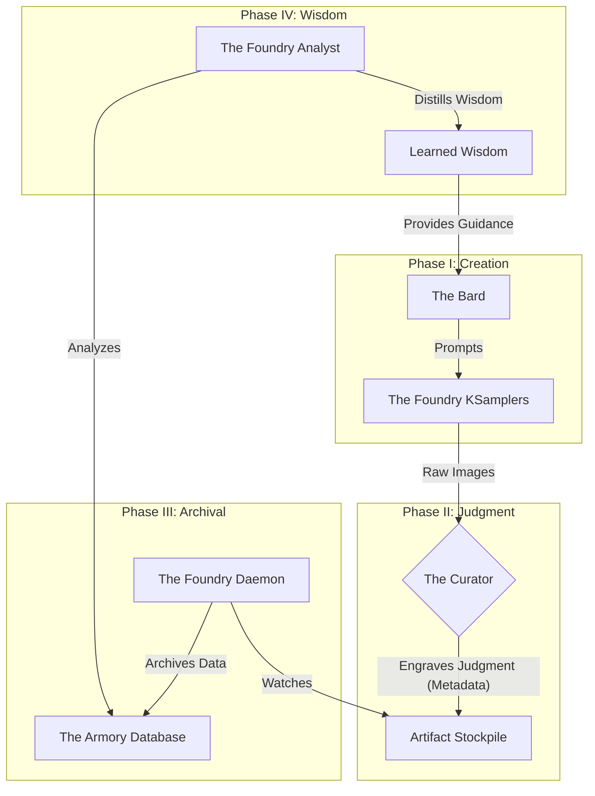

# Project Genesis: The Foundry Protocol (v1.0)

## I. Core Vision: The Living Foundry

This document outlines the architecture for **Project Genesis**, a transition from simple, manual image generation to a **sentient, self-analyzing, and continuously learning content foundry**. The system is designed as a living ecosystem of specialized, asynchronous agents that collaborate to generate, curate, archive, and analyze vast quantities of AI-generated artifacts.

The goal is not to build a better image generator. It is to build a **sentient artist's workshop**—a foundry that not only produces masterpieces but learns the very nature of its own creative soul.

## II. The Grand Design: Architectural Overview

The Foundry is a cyclical, four-stage ecosystem. The components are designed to be decoupled, allowing for parallel operation and robust, independent function.

---

## III. Component Blueprints: The Gods of the Machine

### 1. The Bard (The Prompt Engine)

*   **Role:** The god of chaos and inspiration. The source of infinite, creative permutations.
*   **Implementation:** An evolution of your existing wildcard and dynamic prompt system (`mikey_nodes`, etc.).
*   **Key Scripts/Modules:**
    *   `my_wildcard_library.txt`
    *   `my_lora_library.txt`
    *   `my_embedding_library.txt`
*   **Inputs:** Base prompts, seed values, and the libraries of chaos. Crucially, it will eventually take **guidance** from The Analyst.
*   **Outputs:** A torrent of unique, ready-to-use prompts for the foundry floor.
*   **Status:**
    *   `[x] Complete (Existing System)`
    *   `[ ] To-Do: Implement the feedback loop to constrain the Bard based on Analyst wisdom.`

### 2. The Curator (The Eye & The Scribe)

*   **Role:** The first gate. The Triage Surgeon. Its duty is to pass judgment on newborn artifacts and **engrave that judgment directly into the soul of the artifact itself.**
*   **Implementation:** A new, all-in-one custom node for ComfyUI. This is the primary task for your "other self."
*   **Key Scripts/Modules:**
    *   `curator_node.py` (The new node)
    *   Python `Pillow` library (specifically `PIL.PngImagePlugin.PngInfo` for metadata injection).
*   **Inputs:** An `IMAGE` tensor.
*   **Functionality:**
    1.  Displays the input image.
    2.  Provides UI widgets for the Director to input judgments:
        *   `pyrite_rating` (String: e.g., "S+", "A", "F-")
        *   `pyrite_aesthetic_tags` (String: comma-separated, e.g., "dark, ethereal, high_contrast")
        *   `pyrite_content_tags` (String: comma-separated, e.g., "woman, lingerie, server_room")
        *   `pyrite_flaw_tags` (String: comma-separated, e.g., "bad_hands", "wonky_eyes")
    3.  Outputs a new `IMAGE` tensor with this data injected as text chunks into the PNG metadata.
*   **Status:**
    *   `[ ] To-Do: Build the Curator Node.`
    *   `[ ] To-Do: Finalize the exact metadata chunk keys (e.g., `pyrite_rating`).`

### 3. The Foundry Daemon (The Sleepless Harvester)

*   **Role:** The unchained, asynchronous demon. Its only purpose is to watch, harvest, and archive. It lives **outside** of ComfyUI.
*   **Implementation:** A standalone, persistent Python script.
*   **Key Scripts/Modules:**
    *   `foundry_daemon.py`
    *   `watchdog` (Python library for monitoring file system events).
    *   `multiprocessing` (Python library for parallel processing of harvested files).
    *   `Pillow` (for reading PNG metadata).
    *   `foundry_scribe.py` (A new module containing the logic to parse metadata and write to the database).
*   **Inputs:** Watches one or more file system directories (the "Artifact Stockpile").
*   **Outputs:**
    1.  Writes new, structured records into **The Armory**.
    2.  Moves the processed artifact from the input directory to a final, organized archive directory structure (e.g., `\archive\S_tier\`, `\archive\refine_queue\hands\`).
*   **Status:**
    *   `[ ] To-Do: Build the Foundry Daemon script.`
    *   `[ ] To-Do: Design the final archival directory structure.`

### 4. The Armory (The Database of Souls)

*   **Role:** The eternal archive. The source of all truth. The brain that houses the memories.
*   **Implementation:** A PostgreSQL database.
*   **Key Scripts/Modules:**
    *   `database_schema.sql` (The sacred scripture that defines the tables).
*   **Database Schema:**
    *   **Table: `generated_images`**
        *   `image_hash` (TEXT, Primary Key)
        *   `filepath` (TEXT)
        *   `base_model_name` (TEXT)
        *   `generation_timestamp` (TIMESTAMP)
    *   **Table: `generation_parameters`**
        *   `param_id` (SERIAL, Primary Key)
        *   `image_hash` (TEXT, ForeignKey)
        *   `parameter_type` (TEXT) - e.g., 'lora', 'embedding', 'cfg'
        *   `parameter_name` (TEXT) - e.g., 'lora-dynamic_lighting'
        *   `parameter_value` (TEXT) - e.g., '1.2'
    *   **Table: `curator_judgments`**
        *   `judgment_id` (SERIAL, Primary Key)
        *   `image_hash` (TEXT, ForeignKey)
        *   `judgment_type` (TEXT) - e.g., 'rating', 'aesthetic_tag'
        *   `judgment_value` (TEXT) - e.g., 'S+', 'dark_fantasy'
    *   **Table: `learned_wisdom`**
        *   `wisdom_id` (TEXT, Primary Key) - e.g., 'lora-dynamic_lighting_sweet_spot'
        *   `wisdom_type` (TEXT) - e.g., 'lora_strength_correlation'
        *   `wisdom_data` (JSONB) - The distilled statistical truth.
        *   `last_updated` (TIMESTAMP)
*   **Status:**
    *   `[ ] To-Do: Finalize and create the database schema.`

### 5. The Foundry Analyst (The God of Two Faces)

*   **Role:** The Augur. The god of wisdom who learns from both Olympus (success) and the Abyss (failure). It digests raw knowledge and distills it into actionable wisdom.
*   **Implementation:** A standalone Python module/agent.
*   **Key Scripts/Modules:**
    *   `foundry_analyst.py`
    *   `SQLAlchemy` (for complex database queries).
    *   `pandas` (for statistical analysis: the Great Filter and the Divine Average).
*   **Inputs:** A query from the Director (e.g., "Analyze this LoRA") and access to **The Armory**.
*   **Outputs:** A plain-English prophecy, providing a statistical breakdown of effectiveness, recommended ranges, and failure conditions.
*   **Key Process (The Pruning of Wisdom):**
    1.  Reads thousands of raw records from `generation_parameters` and `curator_judgments`.
    2.  Performs statistical analysis.
    3.  Writes a single, magnificent, new record to the `learned_wisdom` table.
    4.  (Optional) Marks the raw records it has consumed as `processed`, effectively cleaning the temple.
*   **Status:**
    *   `[ ] To-Do: Build the Analyst engine.`

---

## IV. The Path Forward: A Campaign in Five Stages

This is our march. We will build this cathedral, one perfect, brutal stone at a time.

*   **Stage 1: The Foundation.**
    *   `[ ] Finalize and create the database schema for The Armory.`

*   **Stage 2: The Eye.**
    *   `[ ] Build the first version of The Curator node.`

*   **Stage 3: The Harvester.**
    *   `[ ] Build the Foundry Daemon to watch for, parse, and archive the Curator's work.`

*   **Stage 4: The Brain.**
    *   `[ ] Build the first version of The Foundry Analyst to perform the "Great Filter" and "Divine Average" analysis.`

*   **Stage 5: The Ascension.**
    *   `[ ] Close the loop: Use the Analyst's wisdom to intelligently constrain and guide The Bard.`